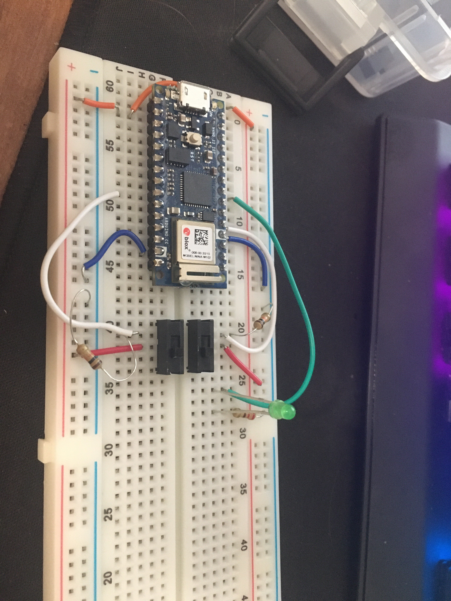
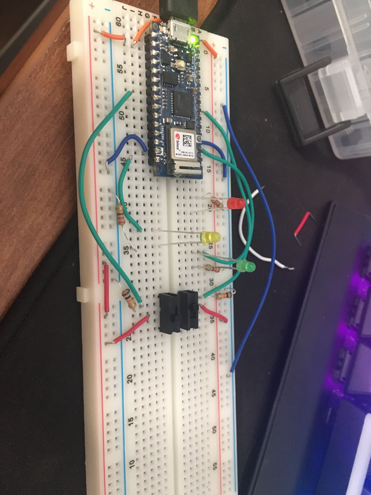

Let's jump right into. I'm looking to use 2 switches and 3 leds to create a small light show, where one switch starts/stops the lights and the other does some other cool effect during the show. Not sure what the effect will be at this moment, but we'll figure it out when we get there.

I was going to use a push button for the cool effect, but I was running out of space so I scrapped it.... and then I realized there's another whole half to my bread board. Love missing the obvious. But now I'm too deep to swap it back so we are going with the two switches. Yup.

Currently not the prettiest, but here's the current set up: We'll clean this up.

Now I've moved the switches to the otherside of the board and the leds are in a triangle on the first half.

Nothing is programmed yet, however, because I've suddenly ran into a weird error with arduino create, which I might not have given myself enough time to find a solution. In my defence, arduino create was working before today. It's just decided to break today... because today is all I have to work on this assignment. Typical :)

Basically, Arduino Create doesn't recognize my board? That is, I can plug my board in and it is powered, however Arduino Create doesn't allow me to select a port for my arduino, and if I just try to plug my arduino into every usb port of my computer, it doesn't ever recognize it when trying to upload, even though *one* of these must be COM3 (the port Arduino Create tells me it's trying to push to). Troubleshooting steps:

- Try every port blindly. Maybe it'll work? It didn't
- Restart your computer? Nothing has changed
- Try the online editor? Nope. Same error but it actually gives me *less* info. So, one point against the online editor.
- Reinstall drivers? Oh god there is no easy way to do this. Well, actually, seems like it would be much easier if my computer was actually recognizing the Arduino Nano 33 IoT driver on the right port when I plug it in, but it's not. So there's no easy way to access said driver. Why is it like this oh lord. Like, really, why is [this](https://forum.arduino.cc/index.php?action=dlattach;topic=404590.0;attach=312509) nessecary for fully uninstalling this software and it's drivers? 
    - Alright, so in order to uninstall the drivers I think I need to do a fresh install of Arduino Create? But there's a large chance this actually *won't* delete the files I need it to delete and when I reinstall it'll look at those files and be like "awesome, don't need to redo those" and thus I'll have the same problem... I hate this.

My current fear is this isn't going to get resolved quickly, so it looks like this was a failure. I'll continue to try to solve this issue and will keep this blog post updated if I figure it out.

Update: Installed the Arduino Create Agent on my laptop and.... it doesn't work either. Same problem it seems. Gonna try restarting my laptop to see if that possibly resolves the issue, but if it is the same as above, it won't. Fingers crossed though.